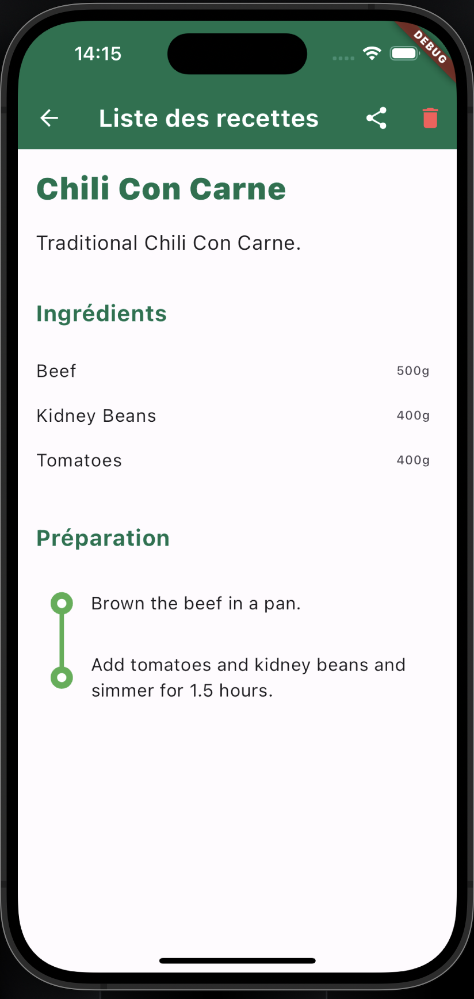

# Quick Recipes

A Flutter application for managing your favorite recipes.

## Description

Quick Recipes is a mobile application designed to help users store and manage their cooking recipes. It uses Hive for data persistence and Flutter for the frontend.

## Features

- Add, modify, and delete recipes
- Manage ingredients and preparation steps
- Support for images in recipes

## Project Architecture

Below is an overview of the project's architecture, highlighting the purpose of each file.

| File Path                                 | Description                                                                                     |
|-------------------------------------------|-------------------------------------------------------------------------------------------------|
| `lib/Models/recipe_model.dart`            | Defines the `Recipe` model, which represents a recipe in the application.                       |
| `lib/Models/ingredient_model.dart`        | Contains the `Ingredient` model used in the recipes.                                            |
| `lib/Models/recipe_type_model.dart`       | Represents different types of recipes, like 'Dessert', 'Main Dish', etc.                        |
| `lib/Dev_data/populate_hive.dart`         | Script for populating the Hive database with initial data for testing.                          |
| `lib/Services/recipe_service.dart`        | Manages business logic related to recipes, including CRUD operations.                           |
| `lib/Views/home_view.dart`                | The main view displaying a list of recipes stored in Hive.                                      |
| `lib/Views/add_recipe_view.dart`          | Allows users to add new recipes to the application.                                             |
| `lib/Views/recipe_detail_view.dart`       | Detailed view of a recipe, showing ingredients and preparation steps.                           |
| `lib/Widgets/recipe_card.dart`            | A widget used in `HomeView` to display a summary of each recipe.                                |
| `lib/Widgets/image_picker_button.dart`    | A widget for picking images from the gallery or camera.                                         |
| `lib/Widgets/automatic_image.dart`        | A widget that automatically determines whether to use a network or local image.                 |
| `lib/Widgets/recipe_form.dart`            | A form widget used in `AddRecipePage` for inputting recipe details.                             |
| `lib/main.dart`                           | The entry point of the application. Sets up Hive and navigation.                                |

## Installation

To install and run this application, follow these steps:

1. Clone the repository.
2. Navigate to the project directory and run `flutter pub get` to install dependencies.
3. Launch the application using `flutter run`.

## Screenshots

